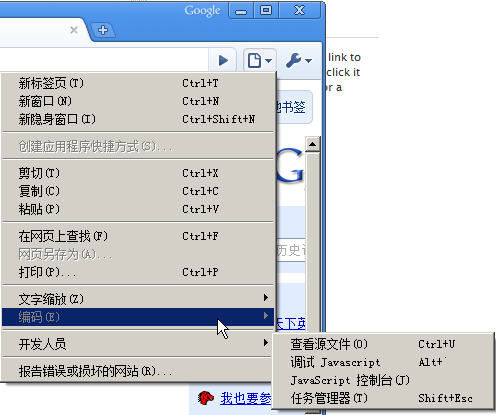
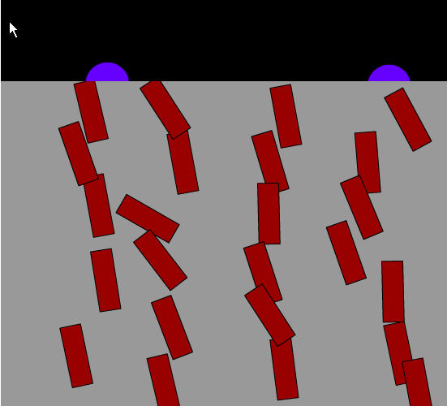
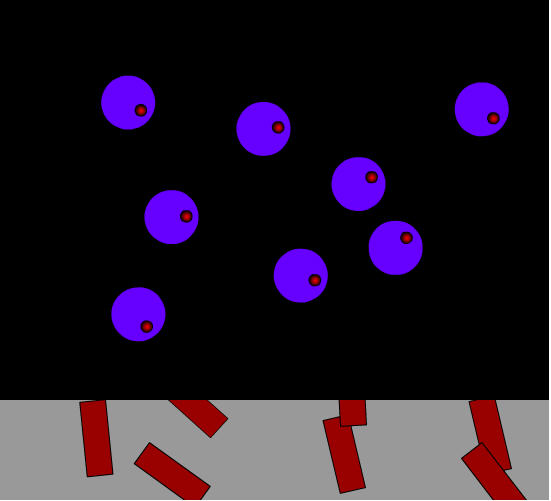

今天一上班就先下了个Chrome浏览器，看看Google这个搜索巨头出的浏览器会是个什么样子的。

刚下了程序安装，卡巴就报典型的木马程序，又是Google在安装Chrome时安装了GoogleUpdate的一个服务，晕了，要Update，学Firefox就不错嘛，干嘛，用户在没有你程序的时候你还放个进程在那边，占用户的资源，还让人觉得你另有所图，尤其是Google这个喜欢收集用户隐私的公司。

好吧，先放你过去吧，装上再说吧。

上面这个就是刚打开时的页面了。样子还算简洁，连菜单栏都没有。这个我喜欢。

上面这个是打开新的标签页时的显示，有最近打开的页面，还有最近的书签，这个还是不错的，不过要是能把Google书签的功能也放进来就不错了。

上面这个就是设置了，里面按用户的不同进行区分，觉得这种分法也还可以，不过，总觉得设置的东西好像没多少。

上面这个是Chrome里面的开发人员工具，初用了一下，觉得还是没Firefox里的好用。

这里还有一个任务管理器，里面还有一个傻瓜统计，可以看到Chrome和其他正在运行的浏览器的资源占用，初看了一下好像资源占用比Firefox 3要高。

上面这个是下载页面，最上面的搜索栏又开始显示Google搜索老大的地位了，不过还没有用它下过东西，看样子好像还不错的样子。

哈哈，上面这个图就是我的杰作了，我发现有时只是点击一个简单的链接竟然整个浏览器到资源占用极高，停止响应了。已经出现多次了。

我之前写过一篇博客<a title="Permanent Link to Firefox下Flash层叠显示的怪异现象" rel="bookmark" href="../index.php/2008/08/14/problem-of-flash-show-in-firefox/">Firefox下Flash层叠显示的怪异现象</a>这个现象在Chrome里面也会出现，但是没那么明显了，只有在滚动滚动条时才会出现层次出错的现象，但是，还是不会像Firefox下那样天下大乱的样子。下面是两个截图，层次真好相反。另一个严重的问题是，本来我想出来的在Firefox下的解决方法，在这个下面又行不通了，即使用了iframe也一样不能正常。唉，看来类似的问题还会有好的，这又会成为很多开发人员的噩梦了。

看来，Google要靠这个浏览器实现他的目标，还有距离啊！