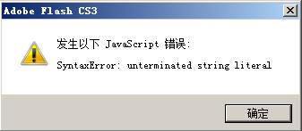

前一阵子写了个Flash网站的框架，类似<a href="http://www.gaiaflashframework.com" target="_blank">GaiaFramework</a>，我也想做一个给它有点类似的Flash扩展，让Flash的操作跟简单，省去重复劳动，所以这两天试着写了一下jsfl，一不小心就遇到了一个“SyntaxError:unterminated string literal”的错误。



网上找了一下，也没找到好的解答。后来看了一下代码，终于明白这个错误是如何出现的了。事实上我是在Flash里调用jsfl读取了一个外部的XML文件，然后，试图在扩展面板运行时打印这段XML的内容时出现了这个错误的。

```
public static function out(m:String)
  
{
  
MMExecute(&#8220;fl.trace(\&#8221;&#8221; + m + &#8220;\&#8221;);&#8221;);
  
}
```

上面这个就是用来调用jsfl在面板运行时打印读取到了XML内容的ActionScript的代码了，跟<a href="http://www.gaiaflashframework.com" target="_blank">GaiaFramework</a>里的是一个样的（算我抄袭他的吧，呵呵！）。也就是调用了fl.trace这个方法打印一个字符串。看上去没什么问题，但是在我把XML作为内容给它时，却出错了，开始还以为是jsfl读取文件时有问题，后来试了一下，把XML中的换行去掉就可以打印。于是，觉得问题还在这个方法了。

再细看这个方法，其实是有问题的，这个跟在jsfl里直接调用fl.trace(m);是不一样的。如果在jsfl中直接调用，那m对于fl.trace这个方法来说就是个字符串变量，fl.trace就是在打印字符串变量了，对于字符串里是不是有换行对这个方法没有影响。

但是上面是在ActionScript中调用fl.trace方法，是没有办法把m这个变量传给fl.trace这个方法的，只能将m变量的值传给fl.trace方法了。&#8221;fl.trace(\&#8221;&#8221; + m + &#8220;\&#8221;);&#8221;这个是一个字符串，而在把它当作jsfl代码执行前，m的值以经是被替换成具体的m变量的值。相当于在执行&#8221;fl.trace(\&#8221;&#8221; + “XXXX”+ &#8220;\&#8221;);&#8221;。而这个时候，如果m的值里面有换行或者&#8221;，‘号时，就会导致上面的这段代码不合js语法。最终导致上面的错误。

如果要解决错误，就的让上面的代码符合语法规范，将换行和“，’等符号替换成相应的转意字符。

```
public static function out(m:String)
  
{
  
m = m.replace(/\&#8221;/g, &#8220;\\\&#8221;&#8221;);
  
m = m.replace(/\&#8217;/g, &#8220;\\\'&#8221;);
  
m = m.replace(/[\r\n]+/g, &#8220;\\r&#8221;);
  
MMExecute(&#8220;fl.trace(\&#8221;&#8221; + m + &#8220;\&#8221;);&#8221;);
  
}
```

上面就是改后的代码，试了一下，错误没有再报，内容也打印出来了。问题解决。其实在其他的javascript中也可能会遇到类似的错误的。
