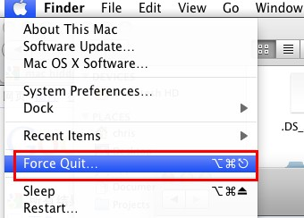
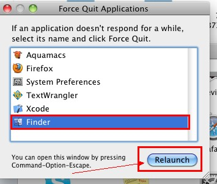

打开Terminal(在Applications/Utilities里找)，这个工具跟windows下的命令行很像的，在里面输入如下命令：

<!--more-->
<pre class="brush: text">
defaults write com.apple.finder AppleShowAllFiles -bool true
</pre>

然后重启Finder，具体方法是直接在Terminal里输入

<pre class="brush: text">
killall Finder
</pre>

或者是点击Mac的屏幕最左上的苹果图标
  
选择“Force Quit”，如下图：


  
在弹出来的窗口中选择“Finder”，点击“Relaunch“，如下图：



OK了，这下隐藏文件就可以看到了，想关闭隐藏文件，只需要将上面的这行命令


```
defaults write com.apple.finder AppleShowAllFiles -bool true
```

改为：

```
defaults write com.apple.finder AppleShowAllFiles -bool false
```

重复其他步骤即可。