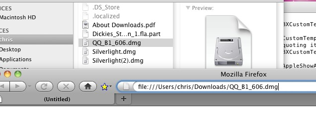

之前写过<a href="http://www.chrislearn.im/index.php/2010/05/20/get-file-path-on-mac/" target="_blank">MAC下获取文件路径小技巧</a>，今天发现，将要查看路径的目录或者文件直接拖放到Firefox浏览器的地址栏里，就可以显示出文件的完整路径，但是试了一个Safari，发现完整路径闪一下，就不见了，不知何故。

   