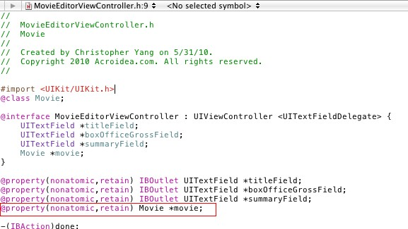
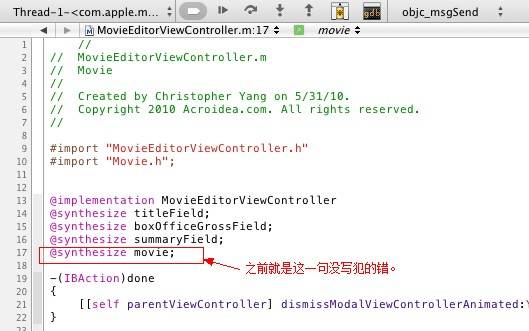

之前转了别人的一篇<a href="http://chrislearn.im/index.php/2010/05/02/how-to-debug-exc_bad_access-on-iphone/" target="_blank">调试iPhone中的EXC_BAD_ACCESS错误</a>的文章。很不幸，今天又遇到这个错误了，没按照这个设置，调了好半天，终于发现问题了：.h文件里的property在.m文件中没有实现。这种情况下XCode不报错，连警告也没有，有点不好调试啊。可能还是刚学吧，经验不足啊。。。

