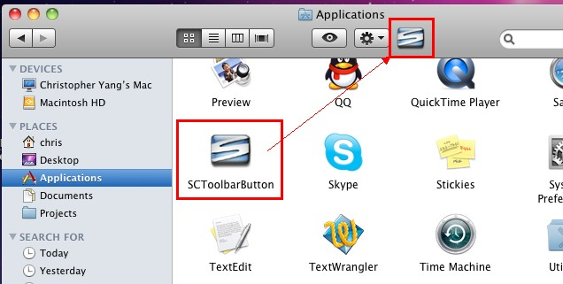
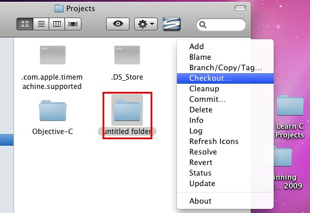
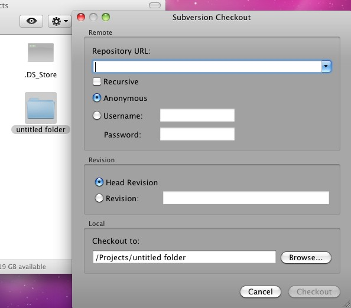

SvnX觉得很不好用，要是能找一个像Windows下的TortoiseSVN一样的客户端就好了。

<!--more-->
<a href="http://scplugin.tigris.org/" target="_blank">SCPlugin</a>这个软件相对而言更像TortoiseSVN，在mac 10.5里是通过右键菜单的方式进行操作，不过在mac 10.6里却没了右键菜单了。改由一个按钮来实现。mac 10.6中下载安装完后，在Applications里会出现一个SCToolbarButton的按钮，将此按钮拖到Finder的工具栏中，就可以使用了。不过相比较TortoiseSVN而言，似乎缺少了一个relocate的功能。

使用时，只需选中相应的文件夹，然后点击工具栏中的按钮进行相应的操作。

