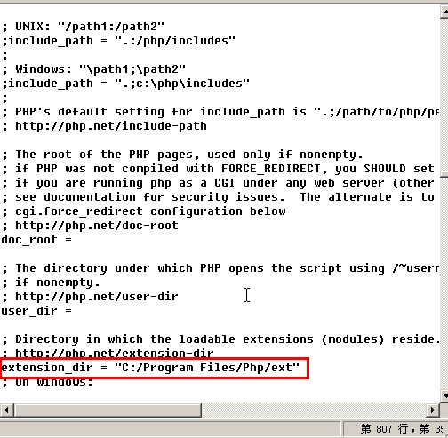
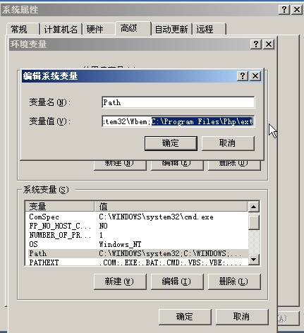

先下载相应的程序：

<a href="http://httpd.apache.org/download.cgi#apache22" target="_blank">Apache 2.2.15-win32</a>
  
<a href="http://windows.php.net/download/" target="_blank">PHP 5.3 (5.3.2)</a>
  
<a href="http://www.mysql.com/downloads/mysql/5.1.html" target="_blank">MySQL Community Server 5.1.47</a>

<!--more-->
先安装Apache

再解压php-5.3.2-nts-Win32-VC9-x86.zip至C:\Program Files\Php。

复制一份php.ini-development，改名为php.ini，把里面相关想要的模块前在“;”去掉。

;extension=php_gd2.dll
  
;extension=php_mbstring.dll
  
;extension=php_mysql.dll
  
;extension=php_mysqli.dll

把extension_dir值改为”C:/Program Files/Php/ext”

把C:\Program Files\Php\ext设置为环境变量。

