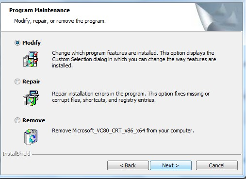

之前有安装过Adobe CS5 Master Collection，但是后来发现Flash CS5出现了一个怪异的问题，在将某些CS4版本的文件保存为CS5后出现文件再也打不开的问题，就怀疑是这个版本有问题，于是就卸载了，从官网上重新下载了一个版本来安装，先是下了一个Flash CS5，安装时一直出现：

<!--more-->
<pre>Exit Code: 7</pre>

这样的错误。没办法，又下了一个Adobe CS5 Master Collection，安装时出现了同样的错误，大体上的错误信息是：

<pre>Exit Code: 7

-------------------------------------- Summary --------------------------------------
- 0 fatal error(s), 93 error(s), 66 warning(s)
WARNING: The payload with AdobeCode:  {CFC9F871-7C40-40B6-BE4A-B98A5B309716} has recommended dependency on:
WARNING:         Family: Adobe Web Suite CS5
WARNING:         ProductName: Adobe Media Encoder CS5 X64
WARNING:         MinVersion: 0.0.0.0
WARNING:         This dependency is not satisfied, because this payload is x64 and is not supported on this machine.
WARNING:         Removing this payload from the dependency list.
WARNING: Payload {DC452AC2-E7C5-4FBA-9162-F14F652E9196} Adobe Flash CS5_AdobeFlash11-en_USLanguagePack is already installed and the session payload {14A2CC02-4638-405D-8190-ECD7BFD32D6E} Adobe Flash CS5_AdobeFlash11-en_USLanguagePack has no upgrage/conflict relationship with it.
WARNING: Payload {6CBB5000-010A-11DF-8C87-0024E8692489} DeviceCentral_DeviceCentral3LP-en_GB is already installed and the session payload {1D830E80-28A4-11DF-A025-0024E8692489} DeviceCentral_DeviceCentral3LP-en_GB has no upgrage/conflict relationship with it.
WARNING: Payload {1AD9BE12-7850-440B-B925-5416FD526F7E} Adobe Flash CS5_AdobeMobileExtension_Flash11-en_US is already installed and the session payload {26B0DF8D-3A8D-4BA9-B131-3B0D9EE87655} Adobe Flash CS5_AdobeMobileExtension_Flash11-en_US has no upgrage/conflict relationship with it.
WARNING: Payload {74102D0E-082F-48c7-93C5-C71D5AA9F68F} Adobe Flash Player 10 Plugin is already installed and the session payload {40F95A03-885A-45fb-9A14-486BEFEDDF34} Adobe Flash Player 10 Plugin has no upgrage/conflict relationship with it.
WARNING: Payload {FB7F30B6-BFBF-4d2c-9F61-B5533659ACBE} Adobe Flash Player 10 Plugin is already installed and the session payload {40F95A03-885A-45fb-9A14-486BEFEDDF34} Adobe Flash Player 10 Plugin has no upgrage/conflict relationship with it.
WARNING: Payload {8FFDDFCA-7540-47F9-928B-1C2CA9CFADF0} Adobe Flash CS5_AdobeMobileExtension_Flash11-mul is already installed and the session payload {579FDC01-BA85-49E7-B16A-2C4CB55F7ACD} Adobe Flash CS5_AdobeMobileExtension_Flash11-mul has no upgrage/conflict relationship with it.
WARNING: Payload {4113D4C1-A4B3-4d3f-921A-8A8DEA2D7E1B} Adobe Flash Player 10 ActiveX is already installed and the session payload {7E5AA19B-0B85-4f44-BA26-728851489200} Adobe Flash Player 10 ActiveX has no upgrage/conflict relationship with it.
WARNING: Payload {5EE868D6-7B6B-49ee-AF60-09B1358AFFD7} Adobe Flash Player 10 ActiveX is already installed and the session payload {7E5AA19B-0B85-4f44-BA26-728851489200} Adobe Flash Player 10 ActiveX has no upgrage/conflict relationship with it.
WARNING: Payload {0A195449-BB77-4F77-B967-0EA64B0970E6} Adobe Flash CS5 is already installed and the session payload {CFC9F871-7C40-40B6-BE4A-B98A5B309716} Adobe Flash CS5 has no upgrage/conflict relationship with it.
WARNING: Payload {55010CE4-4388-4B9A-9345-2521AC6A212E} Adobe AIR is already installed and the session payload {F6FA54C9-3E8F-4416-905C-DA5398DF9640} Adobe AIR has no upgrage/conflict relationship with it.
WARNING: OS requirements not met for {694213D7-1E0E-4C8F-B822-E2E3680C0FCE}
WARNING: OS requirements not met for {6E505C8F-2896-11DF-9B64-0013724DD917}
WARNING: OS requirements not met for {CFC9F871-7C40-40B6-BE4A-B98A5B309716}
WARNING: OS requirements not met for {E4E188D2-27D5-4E4C-92CE-87F9D24AD2F6}
WARNING: Payload cannot be installed due to dependent operation failure
WARNING: Payload cannot be installed due to dependent operation failure
WARNING: Payload cannot be installed due to dependent operation failure
ERROR: The payload with AdobeCode:  {CFC9F871-7C40-40B6-BE4A-B98A5B309716} has required dependency on:
ERROR:         Family: CoreTech
ERROR:         ProductName: Adobe Player for Embedding x64
ERROR:         MinVersion: 0.0.0.0
ERROR:         This dependency is not satisfied, because this payload is x64 and is not supported on this machine.
ERROR:         Removing this dependency from list. Product may function improperly.
ERROR: The payload with AdobeCode:  {CFC9F871-7C40-40B6-BE4A-B98A5B309716} has required dependency on:
ERROR:         Family: Shared Technology
ERROR:         ProductName: Photoshop Camera Raw (64 bit)
ERROR:         MinVersion: 0.0.0.0
ERROR:         This dependency is not satisfied, because this payload is x64 and is not supported on this machine.
ERROR:         Removing this dependency from list. Product may function improperly.
ERROR: The payload with AdobeCode:  {CFC9F871-7C40-40B6-BE4A-B98A5B309716} has required dependency on:
ERROR:         Family: CoreTech
ERROR:         ProductName: AdobeCMaps x64 CS5
ERROR:         MinVersion: 0.0.0.0
ERROR:         This dependency is not satisfied, because this payload is x64 and is not supported on this machine.
ERROR:         Removing this dependency from list. Product may function improperly.
ERROR: The payload with AdobeCode:  {CFC9F871-7C40-40B6-BE4A-B98A5B309716} has required dependency on:
ERROR:         Family: CoreTech
ERROR:         ProductName: Adobe Linguistics CS5 x64
ERROR:         MinVersion: 0.0.0.0
ERROR:         This dependency is not satisfied, because this payload is x64 and is not supported on this machine.
ERROR:         Removing this dependency from list. Product may function improperly.
ERROR: The payload with AdobeCode:  {CFC9F871-7C40-40B6-BE4A-B98A5B309716} has required dependency on:
ERROR:         Family: CoreTech
ERROR:         ProductName: AdobePDFL x64 CS5
ERROR:         MinVersion: 0.0.0.0
ERROR:         This dependency is not satisfied, because this payload is x64 and is not supported on this machine.
ERROR:         Removing this dependency from list. Product may function improperly.
ERROR: The payload with AdobeCode:  {CFC9F871-7C40-40B6-BE4A-B98A5B309716} has required dependency on:
ERROR:         Family: CoreTech
ERROR:         ProductName: AdobeTypeSupport x64 CS5
ERROR:         MinVersion: 0.0.0.0
ERROR:         This dependency is not satisfied, because this payload is x64 and is not supported on this machine.
ERROR:         Removing this dependency from list. Product may function improperly.
ERROR: The payload with AdobeCode:  {CFC9F871-7C40-40B6-BE4A-B98A5B309716} has required dependency on:
ERROR:         Family: CoreTech
ERROR:         ProductName: Adobe WinSoft Linguistics Plugin CS5 x64
ERROR:         MinVersion: 0.0.0.0
ERROR:         This dependency is not satisfied, because this payload is x64 and is not supported on this machine.
ERROR:         Removing this dependency from list. Product may function improperly.
ERROR: Verifying payload integerity : Failed with code 1
ERROR: MsiConfigureProductEx failed with error: 1612
ERROR: Payload {1D830E80-28A4-11DF-A025-0024E8692489} has an action "install" but no resultState
ERROR: The following payload errors were found during install:
ERROR:  - Adobe CSXS Infrastructure CS5: Install failed
ERROR:  - Microsoft_VC90_ATL_x86: Install failed
ERROR:  - SiteCatalyst NetAverages: Install failed
ERROR:  - Microsoft_VC90_CRT_x86: Install failed
ERROR:  - Adobe Bridge CS5: Install failed
ERROR:  - Microsoft_VC80_ATL_x86: Install failed
ERROR:  - Adobe Flash CS5_AdobeFlash11-en_USLanguagePack: Install failed
ERROR:  - Adobe Flash CS5_AdobeMobileExtension_Flash11-en_US: Install failed
ERROR:  - Adobe XMP Panels CS5: Install failed
ERROR:  - Adobe Player for Embedding: Install failed
ERROR:  - AIR2 For Adobe Flash Pro: Failed due to Language Pack installation failure
ERROR:  - Suite Shared Configuration CS5: Install failed
ERROR:  - Photoshop Camera Raw: Install failed
ERROR:  - AdobeColorCommonSetCMYK: Install failed
ERROR:  - AdobeHelp: Install failed
ERROR:  - Camera Profiles Installer: Install failed
ERROR:  - Adobe Flash Player 10 Plugin: Install failed
ERROR:  - AdobeColorJA CS5: Install failed
ERROR:  - Adobe ReviewPanel CS5: Install failed
ERROR:  - Adobe Flash CS5_AdobeMobileExtension_Flash11-mul: Install failed
ERROR:  - Adobe BrowserLab CS Live: Install failed
ERROR:  - Microsoft_VC90_MFC_x86: Install failed
ERROR:  - CSXS Story Extension: Install failed
ERROR:  - Adobe Linguistics CS5: Install failed
ERROR:  - PDF Settings CS5: Install failed
ERROR:  - AdobeTypeSupport CS5: Install failed
ERROR:  - AdobeColorCommonSetRGB: Install failed
ERROR:  - Adobe Flash Player 10 ActiveX: Install failed
ERROR:  - Adobe CSXS Extensions CS5: Install failed
ERROR:  - AdobeOutputModule: Install failed
ERROR:  - AIR2 For Adobe Flash Pro_AIR2_Flash11-en_US: Install failed
ERROR:  - DynamiclinkSupport: Install failed
ERROR:  - Adobe WinSoft Linguistics Plugin CS5: Install failed
ERROR:  - AdobeColorEU CS5: Install failed
ERROR:  - AdobePDFL CS5: Install failed
ERROR:  - AdobeCMaps CS5: Install failed
ERROR:  - AdobeColorNA CS5: Install failed
ERROR:  - Adobe SwitchBoard 2.0: Install failed
ERROR:  - Adobe Flash CS5: Failed due to Language Pack installation failure
ERROR:  - Microsoft_VC80_MFC_x86: Install failed
ERROR:  - Pixel Bender Toolkit: Install failed
ERROR:  - Microsoft_VC80_MFCLOC_x86: Install failed
ERROR:  - Players For Adobe Flash Pro: Install failed
ERROR:  - AdobeJRE: Install failed
ERROR:  - Adobe ExtendScript Toolkit CS5: Install failed
ERROR:  - TLF For Adobe Flash Pro: Install failed
ERROR:  - Adobe AIR: Install failed
-------------------------------------------------------------------------------------
</pre>

网上搜索了很多，都没找到解决办法，于是只能自己解决了。
  
“C:\Program Files (x86)\Common Files\Adobe\Installers\Creative Suite 5 Master Collection 5.0 xx-xx-xxxx.log.gz”解压了这个文件（xx-xx-xxxx是安装时的日期），查看里面的具体出错信息。发现里面有这样一段：

<pre>*=*=*=*=*=*=*=*=*=*=*=*=*=*=*=*=*=*=*=*=*=*=*=*=*=*=*=*=*=*=*=*=*=*=*=*=*=*=*=*=*=*=*
Installer Operation: ModifyThirdPartyPayloadOperation
*=*=*=*=*=*=*=*=*=*=*=*=*=*=*=*=*=*=*=*=*=*=*=*=*=*=*=*=*=*=*=*=*=*=*=*=*=*=*=*=*=*=*
Modify Thirdparty payload
Repairing third party payload with source: D:\Users\Christopher\Desktop\Adobe CS5 Master Collection\Adobe CS5\payloads\Microsoft_VC90_CRT_x86\Microsoft_VC90_CRT_x86.msi
Repairing third party payload
MsiSourceListAddSource for  D:\Users\Christopher\Desktop\Adobe CS5 Master Collection\Adobe CS5\payloads\Microsoft_VC90_CRT_x86\Microsoft_VC90_CRT_x86.msi is 0
MsiSourceListSetInfo with updated name: Microsoft_VC90_CRT_x86.msi, Result: 0
Payload source is not removable so not updating media info
Configuring MSI ProductCode: {08D2E121-7F6A-43EB-97FD-629B44903403}
Setting AFLPath C:\Program Files (x86)\Common Files\Adobe\Installers\{288DB08D-0708-4A94-B055-55B99E39EB62}
MsiConfigureProductEx command line:
 ADOBE_SETUP=1 MSIRESTARTMANAGERCONTROL=Disable REBOOT=ReallySuppress   REINSTALL=ALL REINSTALLMODE=pvoums REBOOT=ReallySuppress PROPERTY_FILE="C:\Users\CHRIST~1\AppData\Local\Temp\adbE7FB.tmp"
1: 0 2: 1033 3: 1252 
1: 0 2: Microsoft_VC90_CRT_x86.msi 3: {08D2E121-7F6A-43EB-97FD-629B44903403} 4: {08D2E121-7F6A-43EB-97FD-629B44903403}; 5: 0 6: 0 7: 1 8: 0 
1: 2 2: 0 
1: 2 2: 1 
[    6124] Wed Jun 23 19:07:33 2010 ERROR
MsiConfigureProductEx failed with error: 1612
</pre>

相信就是Microsoft\_VC90\_CRT_x86.msi这个文件有问题了。
  
到安装文件夹里找到了这个文件（在Adobe CS5 Master Collection\Adobe CS5\payloads\Microsoft\_VC80\_CRT_x86里）。双击这个安装文件，哈哈，出现了这样的界面：

  
看样子，这个程序是被安装了，而“Adobe CS5 Master Collection\Adobe CS5\payloads\”目录下有好多个“Microsoft\_”开头的文件夹，其中某些是以“\_x86”结尾的，有些是以“\_x86\_x64”结尾的，我不机子是Windows 7 64位的，不知道是不是应该装“\_x86\_x64”结尾的而不应该装“_x86”结尾的。管不了那么多了，反正先都点一遍，如果出现的画面显示已经安装的就都卸载了。
  
重新双击安装程序安装，终于，这一次正常了。