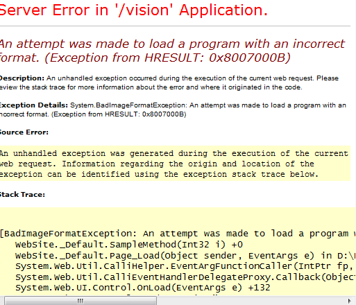
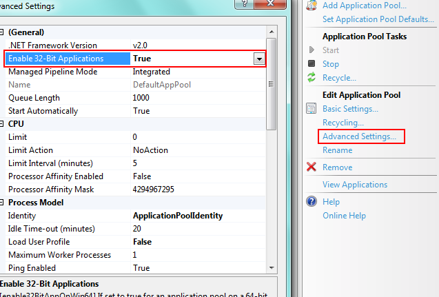

今天在Asp.net里调用非托管的.dll文件时，出现“
  
_An attempt was made to load a program with an incorrect format. (Exception from HRESULT: 0x8007000B)_”这样的错误。

解决方法：

这是由于我使用的操作系统是Windows 7 64位的，而.dll确是32位的，于是出现了这个错误。只需将网站的连接池的设置改成支持32位程序运行就可以解决问题。

