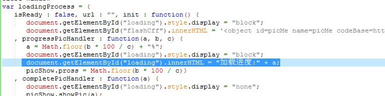
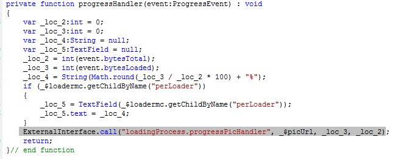

今天偶尔在腾讯上看八卦新闻来着, 注意到了一个奇怪的现象, <a href="http://ent.qq.com/a/20101011/000085.htm#p=11" target="_blank">http://ent.qq.com/a/20101011/000085.htm#p=11</a> 诸如此类的带图片的新闻, 在加载其他张图片时是会显示加载进度的, 但是右键图片发现此处并非flash所做, 真是奇怪了, 难道腾讯在此处没有用flash, 而直接能过javascript来加载图片并且获取到图片加载进度? 感觉不太可能, 在网上找了一阵也没发现用纯javascript实现的这种效果, 于是下载整个网页来看看腾讯到底怎么整出来了. 这一看终于明白了, 原来一切只是表象而已, 事实上还是flash完成了加载.

直接另存这个页面, 在相应的文件夹下有一个叫hd\_min\_v1.js的文件, 还好里面的变量没被压缩, 清晰好认, <a href="http://javascript.about.com/library/blformat.htm" target="_blank">http://javascript.about.com/library/blformat.htm</a> 直接复制到这个网页, 格式化一下, 好认点, 可以看到里面有一个loadingProcess的对象, 内部有一个progressPicHandler的方法, 里面完成了对进度的计算并且写入到一个loading的html元素里:

但是再用ultraedit搜索整个文件夹你也看不到哪边调用了这个方法, 这时回过头来看代码, 里面的init方法中有嵌入一个flash, 所以猜测还是flash里调用了这个方法, 找到文件夹中的loadingAs3.swf这个文件, 通过工具反编译, 终于在里面发现了调用这个方法的代码:

哎, 整活了半天, 才知道原来腾讯也只是通过js向swf发送加载图片请求, 而在swf加载图片的时候swf在侦听加载进度的方法中再次调用js, 完成将进度写到html里, 转了一圈, 终于回来了.