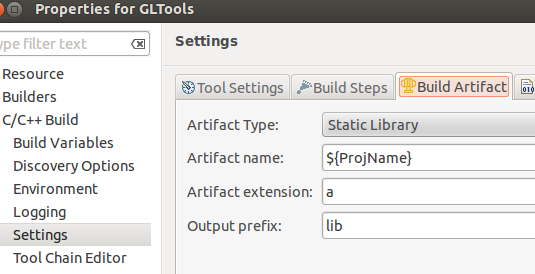
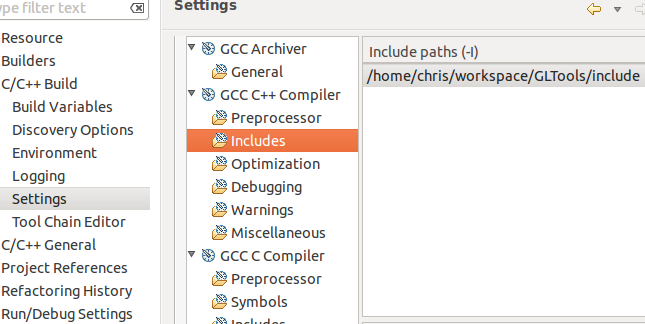
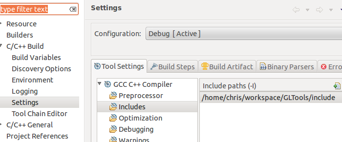
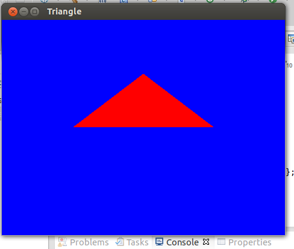

前几天买了本《OpenGL超级宝典（第5版）》打算认真地学习点OpenGL的东西了，不过，首先遇上的麻烦事就是环境配置，在我的Thinkpad 510(Window8+VS2012)下我是怎么也没能配置好，按照书的上说明一步步来，好容易编译成功，但是只要有调用glxxx这样东西的地方立马报错，哎，之前没做过C++的程序，看到这种错误也不知如何解决，网上找了找，有说是因为显卡的问题，不支持OpenGL 3，实在找不到解决办法，就想到到其他系统中试了，我虚拟机里有Mac OS X 和 Ubuntu，不过我一直不喜欢Mac OS X, 只是工作所需才安装的，所以还是到Ubuntu下进行配置了。折腾了N久之后，终于算是配置成功了，大致步骤如下：
  
1. 下载安装Eclipse及C++的开发扩展CDT, 开始我是从 Ubuntu Soft Center 里直接下载的，不过似乎之后在安装C++扩展时打不开安装扩展的窗口，不知何故，后来直接去官网下了一个把这个给覆盖了就正常了。
  
2. 在Ubuntu Soft Center下安装如下几个包：libglu1-mesa-dev, freeglut3-dev, libglew1.6-dev.
  
3. 在Eclipse下打开书中的GLTools项目并编译，我是用了刚刚系统装的glew，所以就把这个项目里的与这个相关的文件给删除了。具体设置如图：

  
4. 在Eclipse下打开书中的Triangle项目并编译，具体设置如图：

终于，这个丑陋的三角形出现在我的面前了，啊哈哈。。。

