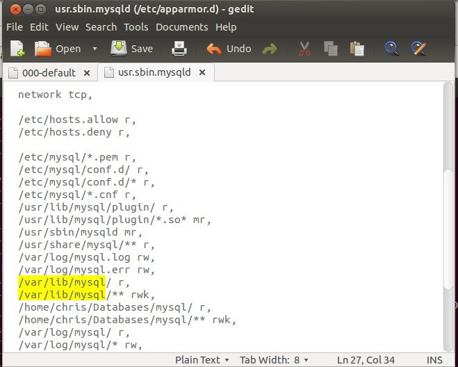

首先自然要安装好Mysql数据库啦，打开 Terminal 输入下面命令：
  
sudo apt-get install mysql-server mysql-client

停止当前的 mysql 服务：
  
sudo stop mysql

将默认的数据目录（/var/lib/mysql) 移至你想要存放的目录路径下，比如我的是 /home/chris/Databases/mysql
  
mv /var/lib/mysql /home/chris/Databases/mysql

在新目录与旧目录位置建立链接:
  
sudo ln -s ~/Databases/mysql /var/lib/mysql

不要修改/etc/mysql/my.cnf，之前看某些文章介绍修改这个里的 datadir，但是我试的结果是修改后不能正常启动，看log日志里写着无权限访问这个新的数据目录。

修改apparmor下的关于mysql的安全配置文件：
  
sudo gksu gedit /etc/apparmor.d/usr.sbin.mysqld

将里面与之前的 /var/lib/mysql 相关的条目复制一份，把路径全部改成新设置的路径，原来的保留，比如我的配置：
  
/home/chris/Databases/mysql/ r,
  
/home/chris/Databases/mysql/** rwk,

重启 apparmor：
  
sudo /etc/init.d/apparmor restart

重启 mysql:
  
sudo start mysql

现在应该一切正常了。
