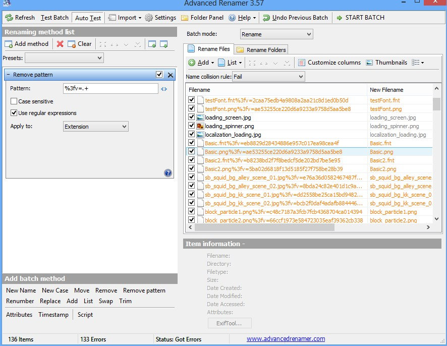

刚刚发现一个很好的文件名批量替换工具，之前用过一个： <http://www.bulkrenameutility.co.uk/Download.php> 感觉太繁琐了，很难搞明白里面的意思，不过今天发现的这个： <http://www.advancedrenamer.com/download>  感觉就很好用了，只一会儿工夫就都搞定了。

我是把一个小游戏所用的素材用Charels全部给保存了，不过文件名有点问题，都带着查询字符串，也不知道Charels里有没有设置可以在保存前就去掉，找了一会没找到，但是用这工具能很快把这些字符串全部去掉，只要写一个简单的与正则表达式就可以了，并且可以在列表中看到替换后的文件名。

