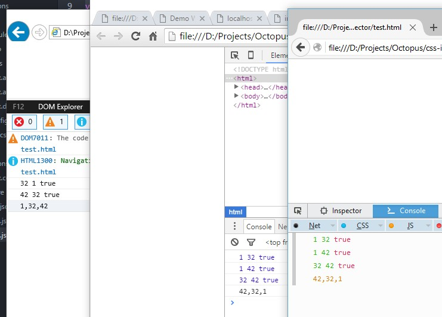
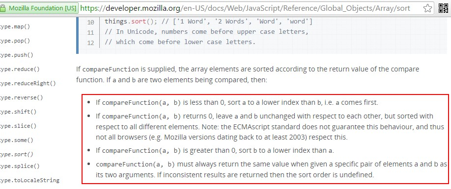
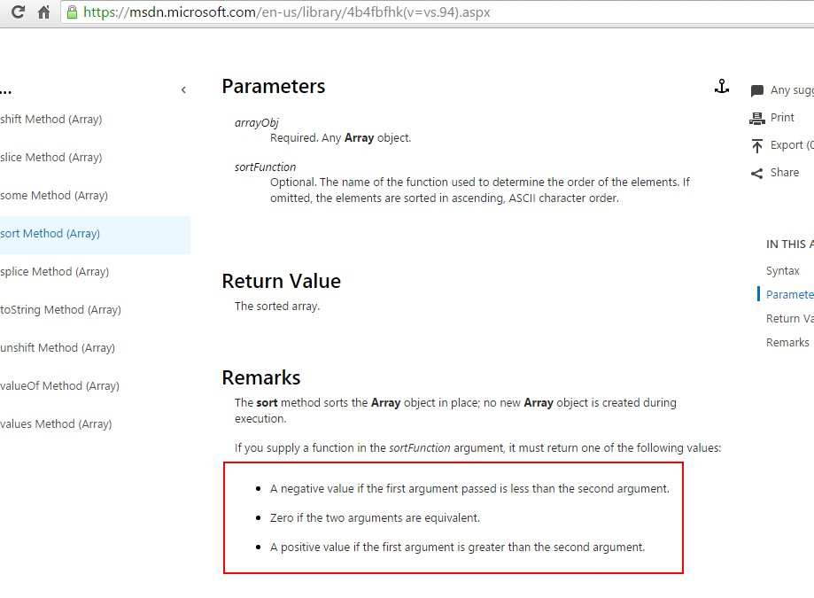

昨晚发现了一个让我无法理解事情, Javascript Array sort 在不同浏览器中竟然有不同表现

<!--more-->
看下面的代码:

    var x = [{id:1, val:1}, {id:1, val:32}, {id:1, val:42}];
    x.sort(function(a, b){
      console.log(a.val, b.val, a.id <= b.id)
      if (a.id <= b.id){
        return 1;
      }else if (a.id > b.id){
        return -1;
      }
    });
    console.log(x.map(function(obj){return obj.val;}).join(','));
    

在IE已经Edge, 1.9.8版本的phantomjs里给出来的结果是: 1,32,42
  
而在Firefox, Chrome, Nodejs 下给出的是: 42,32,1
  
在比较函数里插入了一行代码发现了问题所在:

    var x = [{id:1, val:1}, {id:1, val:32}, {id:1, val:42}];
    x.sort(function(a, b){
      console.log(a.val, b.val, a.id <= b.id)
      if (a.id <= b.id){
        return 1;
      }else if (a.id > b.id){
        return -1;
      }
    });
    console.log(x.map(function(obj){return obj.val;}).join(','));
    

明显看出IE里a跟b的顺序与其他浏览器里不一样, IE里面是反的, 导致在这种特殊情况下结果的不一致, 看一下msdn与mdn上对于这个的不同描述:

 
 

感觉还是mdn上的更好理解, 而且Chrome跟Firefox参数的传入顺序似乎也更符合我们的心理预期.
  
如果排序过程中打印数值长度, 微软系列的竟然是0. 这也很特别.