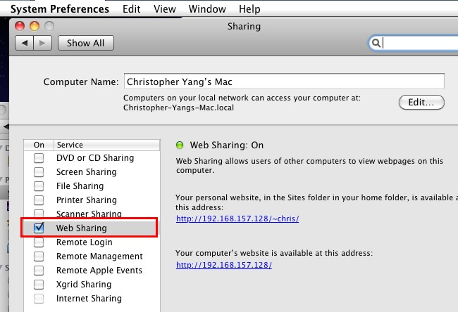
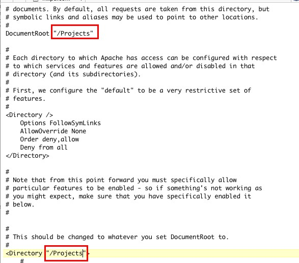
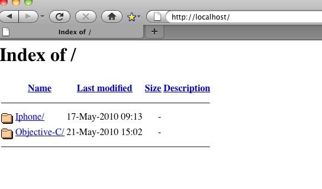

这不是个详细的设置说明，只是一个快速的简单设置，详细的可以查看以下网址：

<!--more-->
<a href="http://www.oreillynet.com/pub/ct/49" target="_blank">http://www.oreillynet.com/pub/ct/49</a>

第一步，打开Web服务：

在系统偏好设置(System Preferences)里选择共享（Sharing)，将其中的Web Sharing给勾上，这样Mac自带的Apache就起动了，点击右侧的两个链接，便可以打开相应的本地网页了。

第二步，设置目录：

我的项目一般放在/Projects下，所以我想把http://localhost的根目录直接设成/Projects，这样调试我的网站项目会方便些。

打开Mac正下的隐藏文件，具体方式请看<a href="http://www.chrislearn.im/index.php/2010/05/20/show-hidden-files-on-mac/" target="_blank">这里</a>，找到/etc/apache2/httpd.conf文件，如果你已经安装了类似TextWrangler这样的文本编辑工具，可以直接用它来修改这个文件，修改时它会提示解锁，如果没安装这样的工具，可以先复制一份这个文件到桌面，修改后再用这个文件来替换原始文件。按下图，将文件中的两处默认的根目录“/Library/WebServer/Documents”改成“/Projects&#8221;。把Web Sharing重启一下（系统偏好设置(System Preferences)里选择共享（Sharing）中的Web Sharing前的勾子去了然后再加上）。

OK，正常这两步就够了，我不需要使用PHP，也不需要使用MySQL数据库，就设置这么多吧。打开浏览器，输入http://localhost，看我的/Projects下的所有目录文件都已经可以在此显示了，如果有网站项目，直接点里面的html文件就可以查看了。

