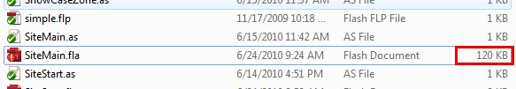
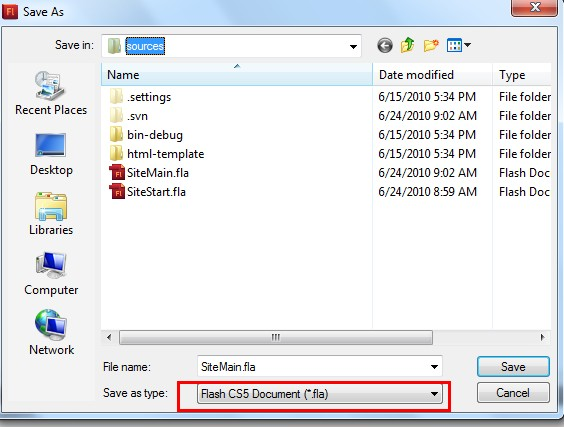
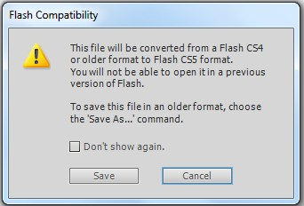
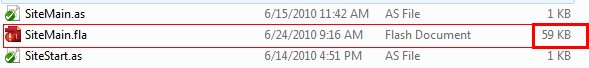
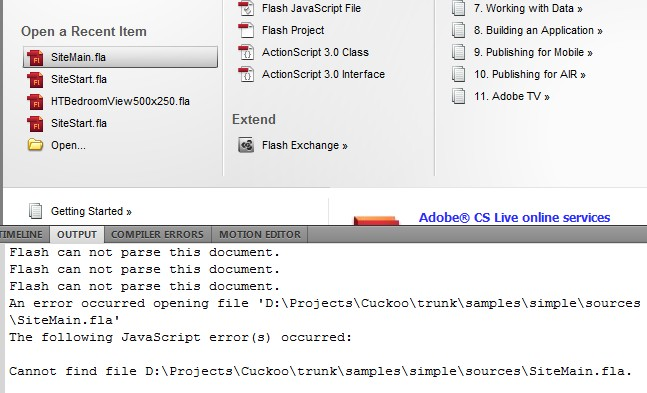
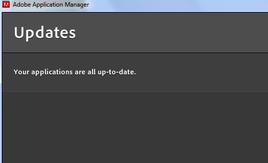

之前用的Flash CS5是从别的网站下的，怀疑是版本有问题，重新从官网下载了一个安装，发现还是有同样的问题。

<!--more--> 
一个原本CS4的FLA文件，用Flash CS5另存一下就不能再正常打开了。并不是所有的FLA文件都会这样，但是对于一个特定的FlA总会出现这样的错误。

这是保存前的文件，大小有120KB：

另存为CS5格式后，文件变小了很多，只有59KB了。

双击文件，已经打不开了。

在点击最近打开的文件后，输出窗口报的错误：

而此时，我的Flash CS5是最新的，已经安装完一个更新，显示没有可用的更新的。

