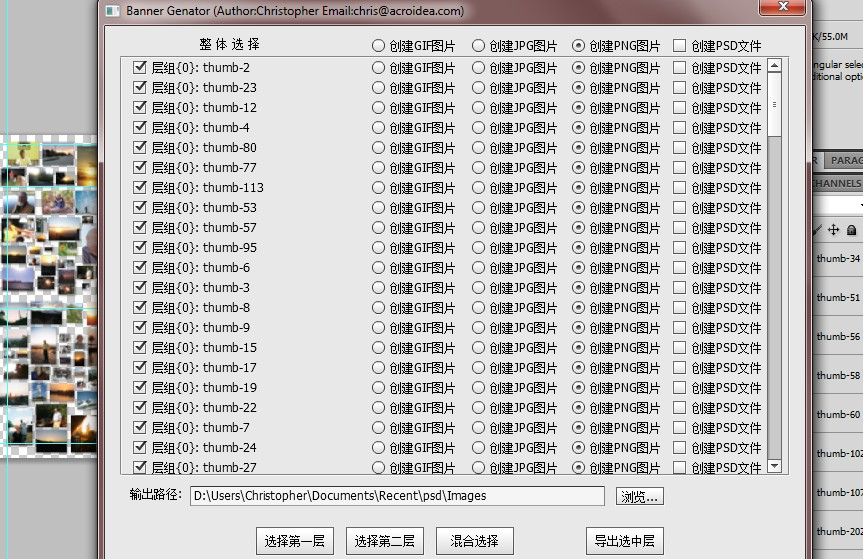
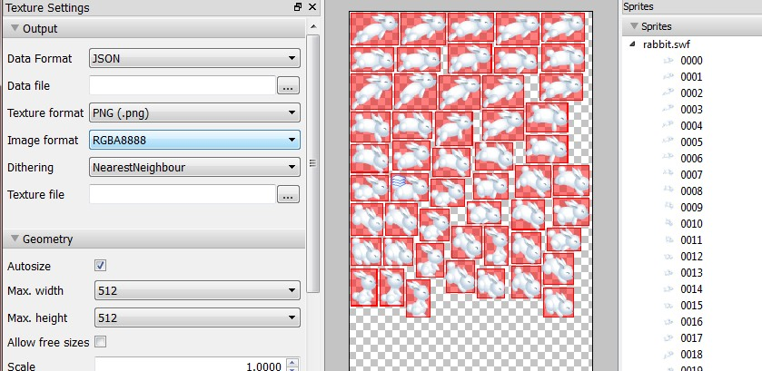

最近又遇上了一个项目，需要把Photoshop中的各层全部导成相应的图片，并且要获取相应的图片在Photoshop中的实际位置的信息，用于在网页中重新生成与Photoshop中一样的整图的效果，于是整了一个JSX的脚本，似乎还挺有用处的，可以将photoshop中相应层中的图片先裁切掉多余的空白，之后将它们保存，并且最终生成一个xml文档或者是json的文档将相应的图像位置信息保存在其中。

<!--more-->
不过还有几点问题：

1. PSD中不能有重名的层，重名的层中的图片会被相互覆盖。

2. PSD中不要有空层，有可能会引起错误。

时间紧，也没时间去完善，只能将就一下了。

另外直接用这个在图片出现重叠时会比较麻烦，好在有另一个强大的软件：<a href="http://www.texturepacker.com" target="_blank">TexturePacker（http://www.texturepacker.com）</a>，这个软件可以在Mac,Windows,Ubuntu等多个主流操作系统上运行， 可以从SWF或者直接将多张图合并成一张纹理图，同时可以生成相应格式的数据，包括JSON格式的，并且这个软件对于有技术类博客的网友，可以免费提供注册证书，无需花银子了，我的就是用的免费的，软件作者还很友好的，配合这个工具，再多的图也可以轻松排了。

