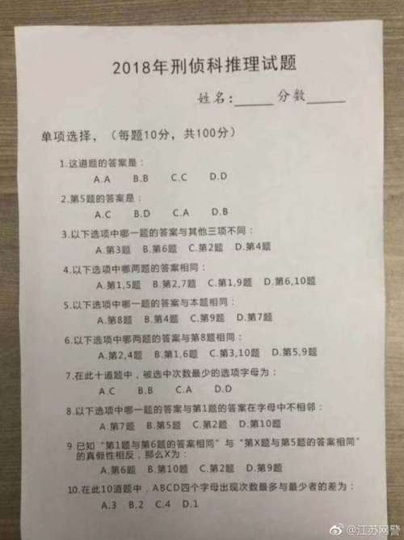

今天同事给发了一道有意思的逻辑推理题, 花了好久终于做出来了. 有兴趣的也可以做做看.

<!--more-->

### 2018年刑侦科推理试题 ###
单项选择（每题10分，共100分）

1\. 这道题的答案是：

&emsp;A.A  &emsp;&emsp;&emsp;&emsp;    B.B   &emsp;&emsp;&emsp;&emsp;   C.C   &emsp;&emsp;&emsp;&emsp;   D.D

2\. 第5题的答案是：

&emsp;A.C   &emsp;&emsp;&emsp;&emsp;   B.D   &emsp;&emsp;&emsp;&emsp;   C.A   &emsp;&emsp;&emsp;&emsp;   D.B

3\. 以下选项中哪一题的答案与其他三项不同：

&emsp;A.第3题  &emsp;&emsp;&emsp;&emsp;  B.第6题  &emsp;&emsp;&emsp;&emsp;  C.第2题  &emsp;&emsp;&emsp;&emsp;  D.第4题 
  
4\. 以下选项中哪两项的答案相同：

&emsp;A.第1、5题 &emsp;&emsp;&emsp; B. 第2、7题 &emsp;&emsp;&emsp; C. 第1、9题 &emsp;&emsp;&emsp; D. 第6、10题
  
5\. 以下选项中哪一题的答案与本题相同：

&emsp;A.第8题  &emsp;&emsp;&emsp;&emsp;  B. 第4题  &emsp;&emsp;&emsp;&emsp;  C. 第9题  &emsp;&emsp;&emsp;&emsp;  D. 第7题

6\. 以下选项中哪两题的答案与第8题相同： 

&emsp;A.第2、4题 &emsp;&emsp;&emsp; B. 第1、6题 &emsp;&emsp;&emsp; C. 第3、10题 &emsp;&emsp;&emsp; D. 第5、9题 
  
7\. 在此十道题中，被选中次数最少的选项字母为：

&emsp;A.C   &emsp;&emsp;&emsp;&emsp;   B.B   &emsp;&emsp;&emsp;&emsp;   C.A   &emsp;&emsp;&emsp;&emsp;   D.D

8\. 以下选项中哪一题的答案与第一题的答案在字母中不相邻：

&emsp;A.第7题  &emsp;&emsp;&emsp;&emsp;   B. 第5题  &emsp;&emsp;&emsp;&emsp;   C. 第2题   &emsp;&emsp;&emsp;&emsp;  D. 第10题
  
9\. 已知“第1题与第6题的答案相同”与“第X题与第5题的答案相同”的真假性相反，那么X为：

&emsp;A.第6题  &emsp;&emsp;&emsp;&emsp;  B. 第10题  &emsp;&emsp;&emsp;&emsp;  C. 第2题  &emsp;&emsp;&emsp;&emsp;  D. 第9题 
  
10\. 在此10道题中，ABCD四个字母出现最多与最少者的差为：

&emsp;A.3   &emsp;&emsp;&emsp;&emsp;   B.2    &emsp;&emsp;&emsp;&emsp;   C.4   &emsp;&emsp;&emsp;&emsp;   D.1

                

这是我的推理方式:

**第一步**我们得把所有的题都读一遍, 大概就猜到, 这种题要利用一些排除法或者通过推理推出矛盾把可能的情况逐步排除, 最后得到一个正确的结果.

看第10题, 有这道题可以计算一下ABCD可能的组合, 咋看好像有好多种, 不过细细想来, 其实没几种. 看第10题的可选答案是1-4. 
我们还可以再看一下第7题, 这道题其实是告诉我们被选得最少的选项是不可能有雷同的.
结合这两个规则, 我们穷举一下, 可能的情况, 每一种情况你都想象最大值可能为多少, 然后退出最小值, 再然后填补其他数值, 一定记住, 最小值不可以有雷同:

- 当差值为1时, 最大值跟最小值直接只相差1, 并且最小值不能重复, 所以, 除去最小值, 其他都是最大值, 一下就能想到这个简单方程组:

  3*max + min = 10

  max - min = 1

  很明显, 压根没有整数解, 所以不肯能最终差值是1. 也就是第10题不可能选 D.

- 当差值为2时, 我们穷举一下可能的情况:

  最大值          | 最小值           | 其他值 | 其他值
  ----            | ---              | --- | --- 
  3 | 1 | 3 | 3

- 当差值为3时, 我们穷举一下可能的情况:

  最大值          | 最小值           | 其他值 | 其他值
  ----            | ---              | --- | --- 
  4 | 1 | 2 | 3

- 当差值为4时, 我们穷举一下可能的情况:

  最大值          | 最小值           | 其他值 | 其他值
  ----            | ---              | --- | --- 
  5 | 1 | 2 | 2
  4 | 0 | 2 | 4
  4 | 0 | 3 | 3

其实总共就这么几种可能. 看一下所有的可能性, 我们很容易发现这一点: **最少选中的选项出现的次数不超过 1**

**第二步**我们以第2题作为突破口, 由第2题的答案可以推出第5题答案, 再有第5题推出某题的答案, 依次往下推导:

题号 | 可能性 1 | 可能性 2 | 可能性 3 | 可能性 4
----  | ---  | --- | --- | ---
2 | A | B | C | D
5 | C | D | A | B
9 | C |   |   |  
7 |   | D |   |  
8 |   |   | A |  
4 |   |   |   | B 
7 |   |   |   | D

下面我们就看看这几种可能中是不是有哪个我们能够确认是不可能成立的.

- 可能性 2, 第7题这时是选的是 D,  也就是说选中次数最少的是 D, 结合我们第一步的推导 **最少选中的选项出现的次数不超过 1**, 很容易就推出矛盾: 这里的 5, 7 都选择了 D, 已经超过了最小选项出现的次数. 所以整个可能性 2 都可以排除掉.

- 可能性 4, 跟 可能性 2 是一样的, 所以也可以整个排除. 

所以现在我们只需要看可能性 1 跟可能性 3:

题号 | 可能性 1 | 可能性 3 
----  | ---  | --- 
2 | A  | C 
5 | C  | A 
9 | C  |  
8 |    | A 

下面看可能性 1. 这里第9题选择了 C, 其实在第二步中我们已经确定 第2题跟第5题是不可能相同的. 所以, 根据第9题就能断定: **第一题跟第6题必定选项相同**

下面我们穷举在可能性 1 的情况下, 第6题选择各种不同结果的情况, 能够推导出哪些题的选项:

题号 | 可能性 1.A | 可能性 1.B | 可能性 1.C | 可能性 1.D
----  | ---  | --- | ---| ---
2 | A       | A                           | A | A 
5 | C       | C                           | C | C
9 | C       | C                           | C | C
6 | A       | B                           | C | D 
1 | A        | B                          | C | D 
4 | A(由6题得)  |                          | A/C |  
8 | A(由6题得)  | B                        |  |C(由6题得)
5 | A(由6题得)  | D (由8题得,1为B,仅D不相邻) |  | 

- 可能性 1.A, A 的数量是 6 超出我们第一步推出的任何一种可能性, 排除.

- 可能性 1.B, 这里的第5题出现了两种答案: C, D, 排除.

- 可能性 1.C, 这个需要回去看一下第四题, 这时, A, C 都成立, 排除.

- 可能性 1.D, 这个需要回去看一下第5题, 选项中包含了 A. 第八题; C. 第9题, 所以, 如果这种情况成立, 那么第5题就有两个结果了, 所以也排除.

至此, 可能性 1 全部被排除. 下面就只剩下可能性 3 了.

题号 | 可能性 3 
----   | --- 
2   | C 
5   | A 
8   | A 
1   | B (由8题选项知5题和2题选项与1题相邻, 而2,5题答案分别为 C,A. 所以推出1题答案为 B) 
7   | D (由8题选项知7题10题可能是答案,但是10题的D选项是1, 第一步已经说明, 这种情况不存在解, 所以只能是7题答案是 D) 

这里, 根据第7题, 选择最少的答案就是D, 而第7题恰恰就是D, 所以第一步中最小值是0的都可以去掉, 最后只剩下下面几种可能:

最大值          | 最小值           | 其他值 | 其他值
----            | ---              | --- | --- 
3 | 1 | 3 | 3
4 | 1 | 2 | 3
5 | 1 | 2 | 2

这里面最少选择的答案都是 1, 也就是说, 第 7 题已经选了 D, 那么其他任何一题不可以再出现 D 了.

下面我们再看一下第6题:

- A. 肯定不可能, 因为2,8题的值已经确定, 不可能相同的.

- B. 肯定不可能, 因为1,8题的值已经确定, 不可能相同的.

- D. 刚才说过, D 不可以再选, 排除.

所以第6题答案只能是 C 了.

继续下面的推导:

题号 | 可能性 3 
----| --- 
2   | C 
5   | A 
8   | A 
1   | B
7   | D
6   | C
3   | A
10  | A
4   | C (由3题知, 2,6题答案已经是C, 4题肯定也是C)
9   | B (1,6题答案不相同, 所以X题答案跟5题一样, 所以X是10题, 答案都是A)

至此, 正确答案就推导出来了:

1 | 2 | 3 | 4 |5 | 6 | 7 | 8 | 9 | 10
---|---|---|---|---|---|---|---|---|---
B | C | A | C | A | C | D | A | B | A 

[原文][1] 下面评论里有其他人的推导过程, 或许跟我的不一样, 既然做出来了, 就不想看了.

[1]: http://user.guancha.cn/main/content?id=6684&comments-container