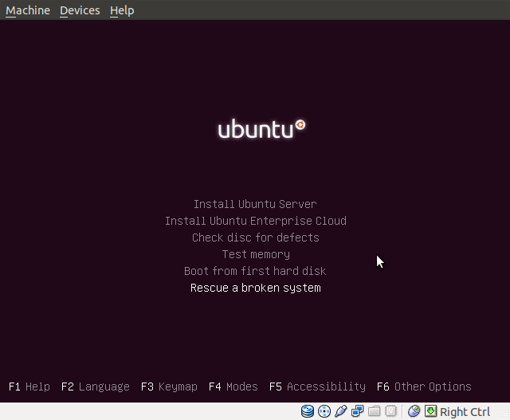

前两天服务器(Ubuntu 18.04.1)重启后出现了这个严重错误, 导致系统无法启动:

<!--more-->
<code>
error: file ‘/grub/i386-pc/normal.mod’ not found
</code>

操作系统用的文件系统使用了LVM, 具体修复过程如下;

- 从安装盘启动系统, 进入修复模式. 不知道为何, 我的选项中不存在 "Rescue a broken system". 直接按下 ALT+F4 进入命令行.

- 安装LVM, 貌似已经默认安装好了.
  
  sudo apt-get install lvm2

- 找到分卷组的名字:
  
  sudo vgdisplay

- 让分卷组可用:
  
  sudo vgchange -ay name-of-vg

- 挂载 root 和 boot 文件系统, name-of-vg 为上一步显示的名称, name-of-root-lv 一般为 root, name-of-boot-partition 我的服务器上是 sda1:
  
  sudo mount /dev/name-of-vg/name-of-root-lv /mnt
  sudo mount /dev/name-of-boot-partition /mnt/boot
  
  可以通过这些命令确定文件系统:
  
  sudo fdisk -l
  sudo blkid
  df -Th
  

- 加载关键虚拟文件系统:
  
  for i in /dev /dev/pts /proc /sys /run; do sudo mount -B $i /mnt$i; done
  

- 更改系统的 root 路径:
  
  sudo chroot /mnt

- 重新安装 GRUB2, 文件系统名不包含分区编号. 这里的 sdX 在我的服务器上是 sda.
  
  grub-install /dev/sdX

- 重新创建 GRUB2 的菜单:
  
  update-grub

- 按 CTRL-D 退出 chroot, 然后重启服务器:
  
  sudo reboot